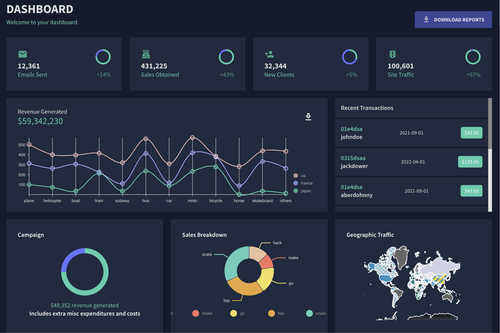

# React Dashboard

## By Liam Campbell

### A dashboard for updating information

### Technologies Used

* React
* Nivo
* Formik 
* Material UI Library
* Yup

### Description

_This application is a dashboard for business operations. A user can add new employees, update sales numbers, and take a quick look at invoices._

### Set up and installation Requirements 

Setup

* Fork this repsitory from github: https://github.com/lcmpbll/Capstone to your desktop

* Navigate to the top level of the directory.

* In your terminal `$npm install` (may need --force or --legacy-peer-deps) 

## License

[Copyright](LICENSE) (c) 1/10/2023 Liam Campbell

## Contact Information 

_Feel free to reach out via [github](https://github.com/lcmpbll)_